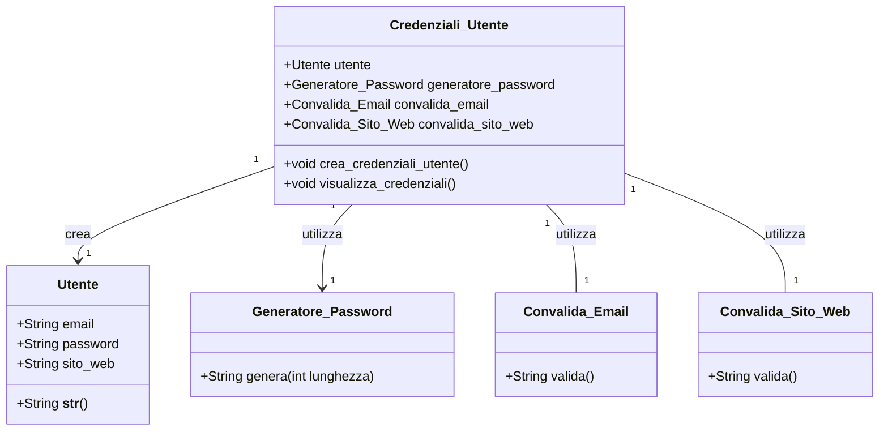

# Credenziali Sicure 💻🔒

Questo programma permette di creare credenziali sicure (email, password e sito web) in modo semplice e veloce. Il processo è guidato dall'utente, che inserisce i propri dati, e il programma si occupa di convalidare l'email e il sito web, oltre a generare una password sicura. 🛡️

## Funzionalità 🌟

1. **Validazione dell'email 📧**: 
   - L'utente inserisce un'email che viene automaticamente verificata per assicurarsi che sia nel formato corretto.
  
2. **Verifica del sito web 🌐**: 
   - Inserendo un sito web, il programma controlla se esiste e se è raggiungibile, garantendo che l'utente non inserisca un URL errato.

3. **Generazione di una password sicura 🔑**: 
   - Una password casuale viene creata automaticamente, con almeno un carattere maiuscolo, uno minuscolo, un numero e un simbolo speciale, per garantire la sicurezza.

4. **Visualizzazione delle credenziali 🎉**: 
   - Alla fine, il programma mostra le credenziali (email, password e sito web) in modo colorato per una lettura chiara e facile.

## Perché usarlo? 🤔

- **Semplicità**: Non devi preoccuparti di formati complessi o di scegliere una password sicura. Il programma lo fa per te!
- **Sicurezza**: Genera una password robusta che protegge i tuoi dati.
- **Verifica automatica**: Non rischi di inserire un'email errata o un sito non raggiungibile.

Con questo programma, creare credenziali sicure non è mai stato così facile! 🎯

---

**Nota**: Il programma è pensato per chiunque desideri un modo rapido e sicuro per creare credenziali online, senza bisogno di essere esperti di tecnologia. 🚀

---

##      Grafico      Mermaid

## Installazione 🔧

Segui questi passaggi per installare il repository le dipendenze e configurare l'ambiente di sviluppo integrato(IDE). Puoi farlo facilmente creando un ambiente virtuale per mantenere tutto separato e gestito correttamente.
## Clonare il Repository 🚀

Per iniziare a lavorare con questo progetto, puoi clonare il repository nel tuo IDE, che di solito è vscode e Segui questi semplici passaggi:

### 1. Clonare il Repository

Prima di tutto, copia l'URL del repository. Puoi trovare l'URL nella parte superiore della pagina del repository su GitHub. 

Poi, esegui il seguente comando nel terminale o nel prompt dei comandi (assicurati di avere **git** installato):

```bash
git clone https://github.com/KamilIbragimov/Progetto_Galo_Di_Natale.git
```


2. **Crea un ambiente virtuale**:  
   Esegui il comando seguente per creare un ambiente virtuale. Questo ti permette di gestire le dipendenze senza influire sul resto del sistema.
   ```bash
   python -m venv venv
### Attiva l'ambiente virtuale:

Una volta creato l'ambiente, attivalo con il comando adatto al tuo sistema operativo.

- **Su Windows**:
    ```bash
    venv\Scripts\activate
    ```

- **Su macOS/Linux**:
    ```bash
    source venv/bin/activate
    ```
### 3. Installa le dipendenze:
Ora che l'ambiente virtuale è attivo, installa le librerie necessarie per eseguire il programma con il comando:

```bash
pip install -r requirements.txt
```
## 🚀 Avvio del Programma
Per avviare il programma, basta eseguire il seguente comando nel terminale
```bash
    python Credenziali.py                          
```

## Autori 🦹
- Kamil Ibragimov- kamil.ibragimov@studenti.isissgobetti.it

## Licenza👮‍♂️
Questo progetto è distribuito sotto la licenza MIT. Vedi il file LICENSE per ulteriori dettagli.
